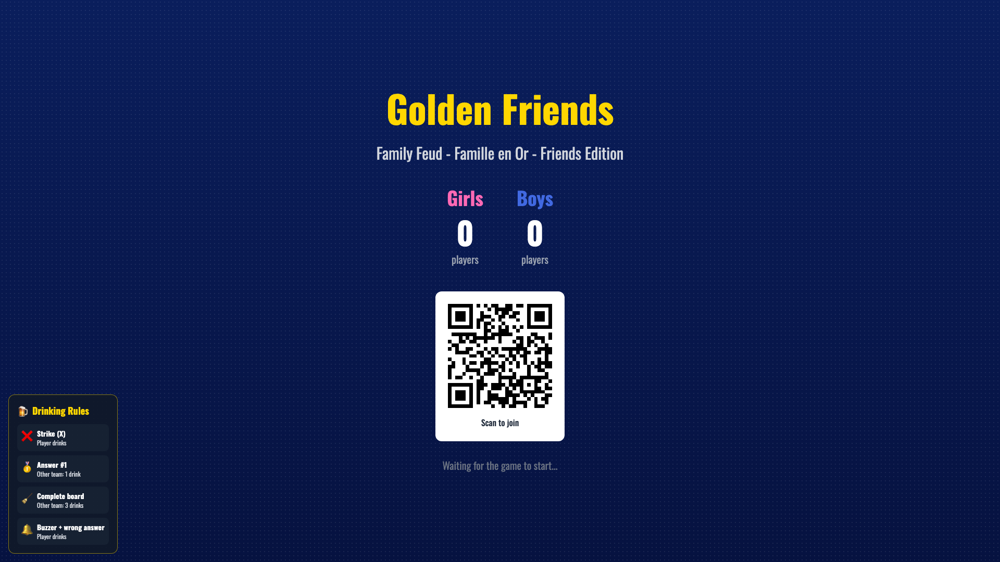
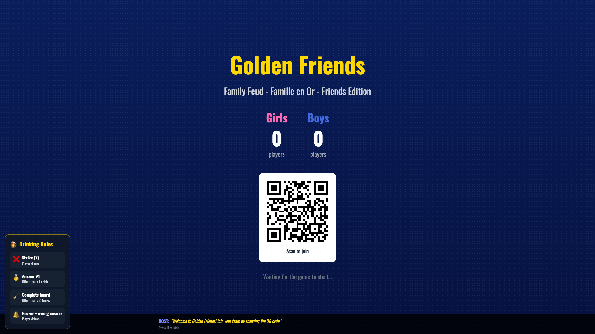
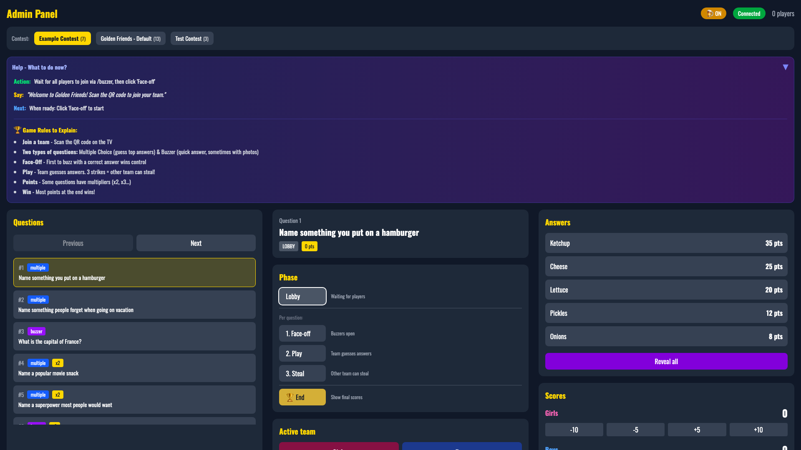
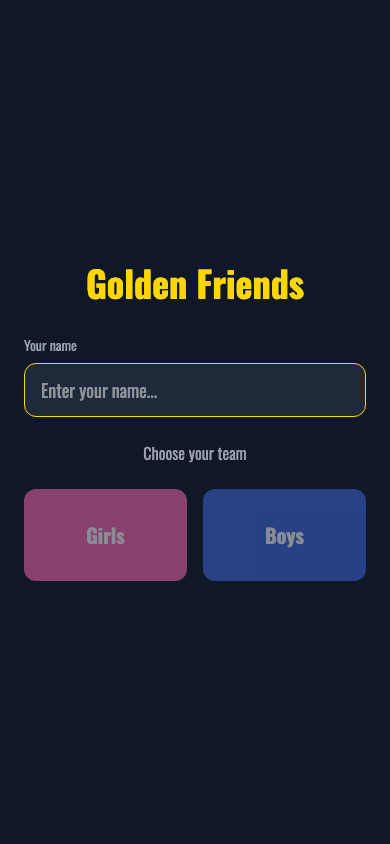
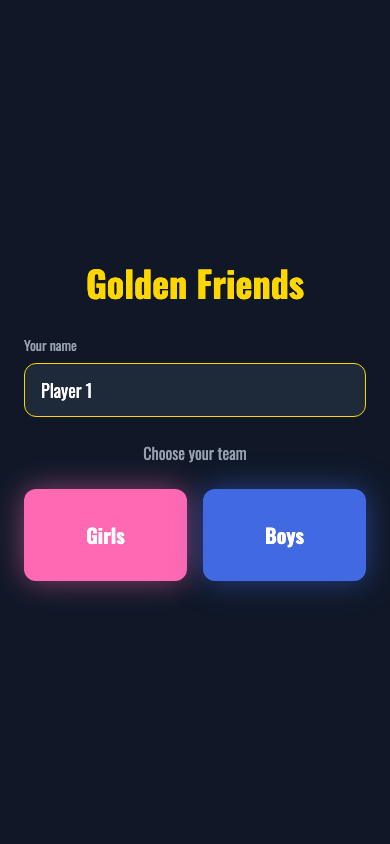

# Golden Friends

A Family Feud-style party game built with Next.js and Socket.io. Features a TV display, admin panel, and mobile buzzers for players.

I created this game for the New Year Eve 2025 party, see the questions in src/data/contests.

## Screenshots

### Landing Page
The home screen where players can access the TV display, admin panel, or join as a player via buzzer.


### TV Display (Lobby)
The TV screen shown while waiting for players to join. Shows team counts and a QR code for easy joining.



### TV Display (Host Mode)
Press 'H' on the TV display to show host prompts at the bottom of the screen.



### Admin Panel
The game host controls everything from here: select contests, navigate questions, reveal answers, manage scores, and control game phases.



### Mobile Buzzer
Players join on their phones by entering their name and selecting a team (Girls or Boys).





## Endpoints

- `/` - Home page
- `/tv` - TV display for the game
- `/admin` - Admin panel to control the game
- `/buzzer` - Mobile buzzer for players

## Setup

```bash
npm install
```

## Development

```bash
# Terminal 1: Next.js frontend
npm run dev

# Terminal 2: Socket.io server
npm run dev:server
```

## Testing

```bash
npm test              # Run tests once
npm run test:watch    # Run tests in watch mode
npm run test:coverage # Run tests with coverage report
```

## Production

```bash
npm run build
npm start
```
